# The Place of Euclid's Elements in Early Modern Mathematical Print: A Title-Page Ecology

Leading question:

**What place did the metadata-defined Elements corpus occupy in the broader ecology of early modern mathematical print, and how did title pages construct that place through social address, intellectual values, and acts of textual/mathematical mediation?**

Reader's note:

This report is written for later reading and annotation. It assumes no memory of the exploratory analysis that produced it. Technical feature names, generated tables, and classification details are kept in the appendices where possible; the main text uses historical descriptions and defines the few repeated analytical terms it needs.

## Table Of Contents

| Section | Title |
|---:|---|
| - | Key Terms |
| 0 | Executive Argument |
| 1 | Corpus, Object, And Reading Strategy |
| 2 | The Surrounding Mathematical Print Ecology |
| 3 | Locating The Elements Within The Ecology |
| 4 | The Internal Ecology Of The Elements Corpus |
| 5 | Book Coverage As Historical Repackaging |
| 6 | Format, Size, And Material Presentation |
| 7 | Social Worlds Of The Elements |
| 8 | Intellectual Values Of The Elements |
| 9 | Mathematical Parts Of Euclid On Title Pages |
| 10 | Restoration, Reconstruction, And Competing Euclids |
| 11 | Boundaries And Gradients |
| 12 | Silence, Density, And Title-Page Fashion |
| 13 | Final Synthesis |
| 14 | Next Directions |
| - | Appendices |

## Key Terms

The report uses a few repeated analytical terms. These are not self-evident historical categories; they are operational terms derived from title-page features.

| Term in prose | Operational meaning in the data | Why it matters |
|---|---|---|
| **Metadata-defined Elements corpus** | The representatives manually identified in the metadata as primarily editions of Euclid's *Elements*. | This is the report's object. It is not defined by whether the title page happens to say "Euclid" or "Elements." |
| **Surrounding mathematical ecology** | The other representative mathematical title pages in the corpus: arithmetic, instruments, practical geometry, cosmography, mechanics, perspective, architecture, commerce, music, etc. | This is the comparison field that lets us see what is distinctive about the Elements. |
| **Explicit Euclid/book identity** | The feature formerly labeled `claim_canonical_textual_identity`: title-page language presenting the work through Euclid, the *Elements*, numbered books, textual corpus identity, edition identity, or author/title authority. | This measures whether a title page makes a book legible through an authoritative textual object, not merely through a practical use or subject. |
| **Canon / canonical** | In this report, "canonical" does **not** mean timeless, universally fixed, or inherently superior. It means that a title page treats a work, author, or textual corpus as an authoritative point of reference that can organize later mathematical labor: correction, translation, commentary, teaching, selection, reform, or application. | This lets us say that Euclid is authoritative without assuming that the *Elements* was stable, uniform, or untouched. |
| **Ancient authority/restoration** | Claims that attach the work to ancient authority, recovery, correction of tradition, Greek/Latin humanist mediation, or restoration of an older text. | This separates Euclid as an ancient textual authority from geometry as a general subject. |
| **Mediation** | Advertised acts performed on mathematical knowledge: translating, correcting, explaining, demonstrating, selecting, augmenting, furnishing with figures, reorganizing, or adapting. | The core argument is about how title pages make the Elements into different kinds of usable object. |
| **Direct practical/procedural application** | Claims of use, practice, operation, construction, measurement, instruments, profession, examples, problems, or applied procedure. | This is the strongest contrast with many non-Elements mathematical books. |

## 0. Executive Argument

The metadata-defined corpus of Euclid's *Elements* occupied a distinctive but flexible place in early modern mathematical print. Its title pages do not present it merely as a stable ancient text, nor simply as one branch of geometry. They present it as an authoritative demonstrative corpus repeatedly mediated through translation, correction, commentary, selection, explanation, new demonstrations, added figures, institutional authority, and practical adaptation.

The broadest pattern is not a simple opposition between "theoretical Euclid" and "practical mathematics." The better distinction is between **mediating an authoritative text** and **advertising direct practical or procedural application**. Elements title pages overwhelmingly emphasize ancient authority, explicit Euclid/book identity, translation, correction, demonstration, and apparatus. Surrounding mathematical books more often advertise operations, instruments, professional users, visual aids, problems, examples, and direct utility. But the two zones are not sealed off from one another: Euclid also appears outside the Elements corpus as a foundation for practical geometry, and some Elements editions turn Euclid toward public, pedagogical, or practical use.

This report therefore treats the Elements as a corpus with a stable metadata boundary but porous intellectual and social boundaries. Early modern print could make Euclid into several different things: an ancient text to be restored, a school object to be explained, a vernacular book to be transferred, a Jesuit or institutional corpus to be furnished, a sequence of propositions to be used, a set of demonstrations to be improved, or a foundation for practical geometrical work beyond the Elements itself.

The central historical claim is that the title page is not only a label. It is a public statement of what kind of mathematical work the book performs. Across the corpus, title pages advertise acts: translating, correcting, augmenting, demonstrating, explaining, selecting, reducing, furnishing, and reorganizing. The Elements is especially visible as a corpus on which these acts are repeatedly performed.

**Core contrast, in one table:**

| Title-page feature | Elements | Non-Elements | Difference |
|---|---:|---:|---:|
| Ancient authority/restoration | 83.2% | 12.0% | +71.2 pp |
| Explicit Euclid/book identity | 86.7% | 26.6% | +60.1 pp |
| Method/demonstration/order | 42.0% | 16.3% | +25.6 pp |
| Any named deductive part | 57.7% | 34.8% | +22.9 pp |
| Translation/transfer | 26.2% | 8.4% | +17.8 pp |
| Augmentation/composition | 40.9% | 28.7% | +12.2 pp |
| Selection/extraction | 17.8% | 7.0% | +10.8 pp |
| Utility/practice/application | 7.7% | 17.8% | -10.1 pp |

Historical payoff: the Elements does not stand apart because it is simply "theoretical." It stands apart because title pages attach practical, pedagogical, and editorial acts to an authoritative ancient proof-corpus. Non-Elements books more often present mathematical knowledge as immediate procedure, operation, use, or professional practice.

Figure:

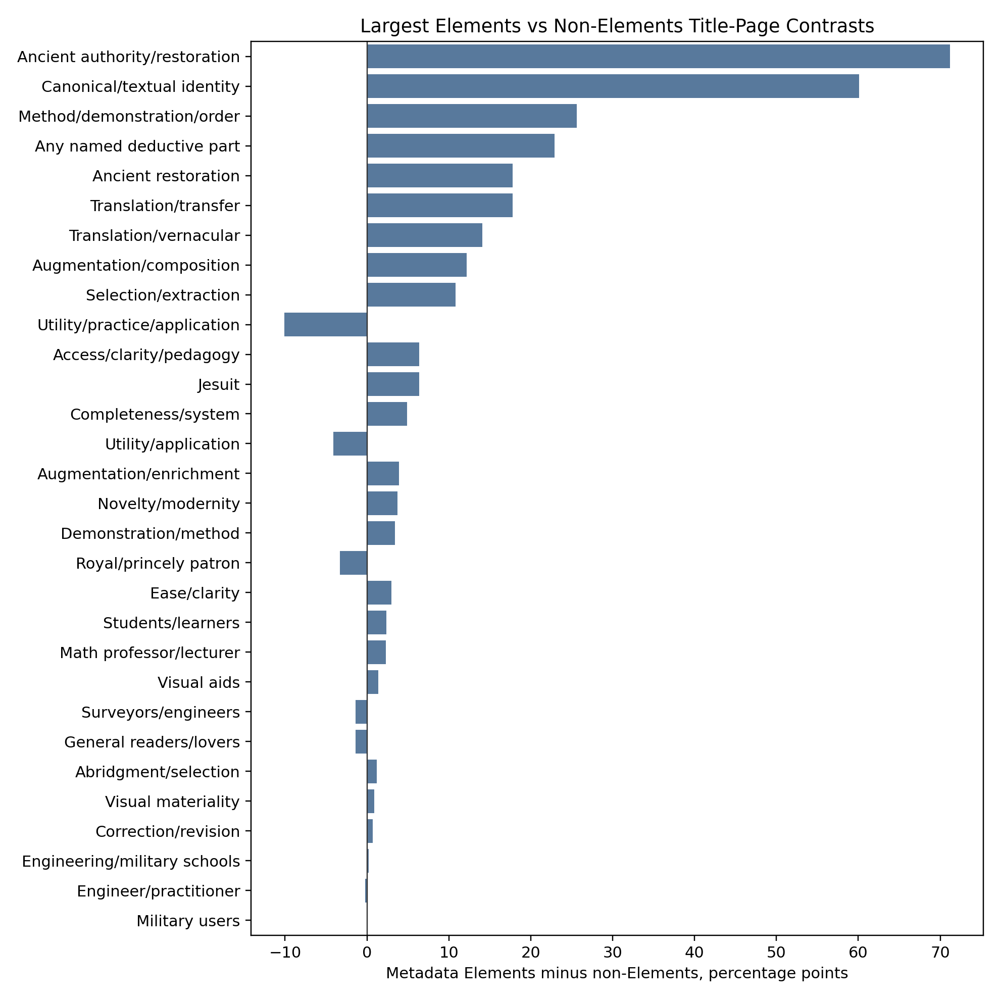

## 1. Corpus, Object, And Reading Strategy

This report studies a corpus of 843 representative title-page records from early modern mathematical print. Within it, 286 representatives are identified in the metadata as editions primarily belonging to Euclid's *Elements*. The remaining 557 representatives form the surrounding mathematical ecology: arithmetic, practical geometry, instruments, astronomy and cosmography, mechanics, military mathematics, perspective, architecture, commerce, music theory, and other mathematical or mixed mathematical books.

The central object is not every book that mentions Euclid or uses the word "Elements" on its title page. The central object is the metadata-defined Elements corpus. Mentions of Euclid or "elements" outside that corpus are important, but they are treated as ecological comparison: they show how Euclidean authority and elementary mathematical organization circulated beyond books primarily identified as editions of Euclid's *Elements*.

The evidence here is title-page evidence. A title page does not tell us everything in the book. It tells us how the book publicly presents itself: what authority it claims, what audiences it names, what intellectual values it advertises, what transformations it says have been performed, and what parts of mathematical knowledge it foregrounds. The report therefore distinguishes between three levels of evidence:

1. **Advertised claims**: words and phrases on the title page, such as translated, corrected, explained, augmented, demonstrated, or illustrated.
2. **Inferred positioning**: broader social or intellectual roles suggested by these claims, such as learned restoration, institutional teaching, practical utility, or vernacular access.
3. **Book contents**: the full internal structure of the edition, which would require separate reading beyond the title page.

This distinction matters because silence on a title page is not absence from the book. A book can contain diagrams without advertising diagrams; it can contain axioms without making axioms a selling point. The report therefore reads title pages as public framing, not as full bibliographical or textual description.

The data includes subject classifications, title-page feature tags, social markers, intellectual-value markers, metadata fields such as format, and derived groupings for the Elements corpus. These technical classifications are useful for aggregation, but the prose uses human descriptions: for example, "apparatus-rich Euclid" rather than an internal mode label, and "Euclid made teachable or usable" rather than a code name.

**Corpus count:**

| Unit | Count |
|---|---:|
| Representative title-page rows | 843 |
| Metadata-defined Elements representatives | 286 |
| Non-Elements representatives | 557 |
| Rows with at least one named deductive/mathematical part | 359 |

The percentages in the report use these representative rows as denominators unless otherwise stated.

## 2. The Surrounding Mathematical Print Ecology

Before asking what is distinctive about the Elements, we need to understand the mathematical print ecology around it. That ecology is not organized by a simple pure/applied hierarchy. It is better understood as overlapping zones of mathematical work: geometry and theory, practical geometry and surveying, instruments and measurement, arithmetic and commerce, cosmography and astronomy, mechanics and military mathematics, visual and spatial arts, and music.

The first non-trivial result is that subject zones have different title-page grammars. They do not merely name different content; they promote different virtues of mathematical knowledge.

**Selected intellectual-value rates by subject zone:**

| Primary subject zone | Augmentation/enrichment | Method/demonstration | Utility/application | Correction/revision | Visual materiality | Ancient restoration |
|---|---:|---:|---:|---:|---:|---:|
| Instruments/Measurement | 21.2% | 20.2% | 16.3% | 9.6% | 13.5% | 3.8% |
| Arithmetic/Commerce | 20.8% | 16.7% | 13.2% | 12.5% | 4.9% | 2.1% |
| Applied Mechanics/Military | 15.8% | 17.5% | 7.0% | 8.8% | 8.8% | 1.8% |
| Geometry/Theory | 15.8% | 14.2% | 7.1% | 6.1% | 6.4% | 11.8% |
| Cosmos/Earth | 15.0% | 8.8% | 8.8% | 1.2% | 1.2% | 10.0% |
| Visual/Spatial Arts | 3.6% | 9.1% | 4.5% | 3.6% | 6.4% | 0.9% |

Historical payoff: the practical zones are not simply "applied" in a flat sense. Instruments/measurement books sell mathematics as method plus utility plus visual/material apparatus. Arithmetic/commercial books sell it as corrected, augmented, usable procedure. Geometry/theory is the zone most naturally adjacent to the Elements because it has higher ancient-restoration and translation signals, but it is not isolated from utility or method.

Figure:

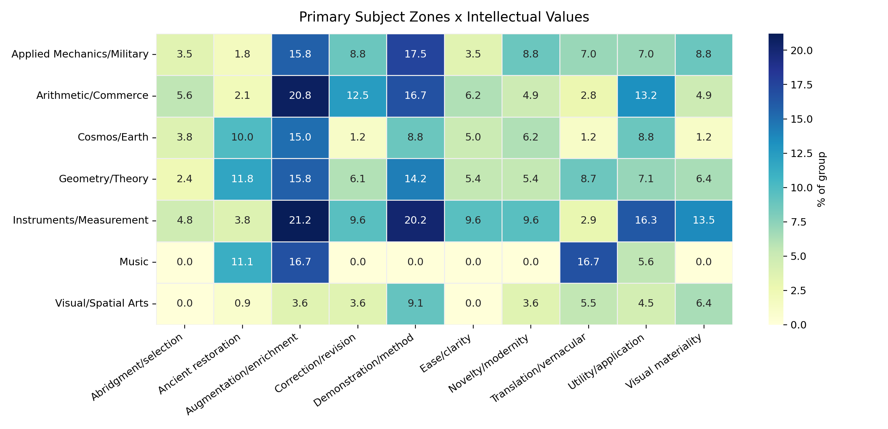

The second result is about social address. Explicit occupational audiences exist, but they are not the only social mechanism on title pages. Mathematical books also gain authority through offices, institutions, patrons, translators, editors, professors, religious orders, and civic or courtly affiliation.

**Selected social rates by subject zone:**

| Primary subject zone | General readers/lovers | Math professor/lecturer | Engineer/practitioner | Surveyors/engineers | Royal official | Named private patron |
|---|---:|---:|---:|---:|---:|---:|
| Applied Mechanics/Military | 10.5% | 10.5% | 5.3% | 1.8% | 21.1% | 21.1% |
| Instruments/Measurement | 7.7% | 10.6% | 2.9% | 6.7% | 12.5% | 20.2% |
| Geometry/Theory | 6.6% | 7.8% | 2.1% | 1.7% | 6.1% | 21.2% |
| Arithmetic/Commerce | 4.9% | 8.3% | 1.4% | 1.4% | 3.5% | 10.4% |
| Visual/Spatial Arts | 10.0% | 2.7% | 3.6% | 0.9% | 2.7% | 21.8% |

Historical payoff: title pages often authorize mathematical knowledge socially without naming a schoolroom or a profession. A named private patron, royal official, professor, city surveyor, Jesuit author, or translator can matter as much as an explicit "for students" or "for surveyors." This will matter later because Elements editions often relocate Euclid through institutional and editorial authority rather than through direct occupational audiences.

Figure:

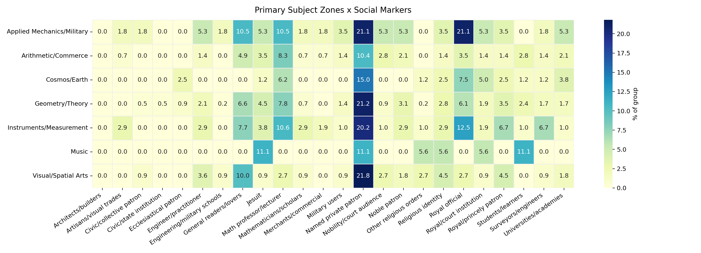

The surrounding ecology therefore matters not as background noise but as the comparison that makes the Elements historically visible. It shows that early modern mathematical print offered multiple ways of making mathematics public: as professional tool, practical operation, visual method, learned text, pedagogical sequence, institutional curriculum, or corrected ancient authority.

## 3. Locating The Elements Within The Ecology

The metadata-defined Elements corpus is sharply distinctive, but not in the simple sense that it is "theoretical." Its title pages are distinctive because they bind an authoritative textual object to repeated acts of mediation.

**Main Elements/non-Elements contrasts:**

| Feature | Definition used in this report | Elements | Non-Elements | Historical reading |
|---|---|---:|---:|---|
| Ancient authority/restoration | Ancient, Greek/Latin, recovered, corrected tradition, humanist authority | 83.2% | 12.0% | The Elements is overwhelmingly framed as inherited authority. |
| Explicit Euclid/book identity | Euclid, Elements, numbered books, textual corpus identity, edition identity | 86.7% | 26.6% | Elements title pages make the book legible as an authoritative corpus, not just a topic. |
| Method/demonstration/order | Demonstrated, methodized, ordered, proved, newly demonstrated | 42.0% | 16.3% | Euclid's authority is often tied to demonstrative form. |
| Named deductive/mathematical part | Propositions, demonstrations, scholia, figures, corollaries, problems, etc. | 57.7% | 34.8% | Elements title pages often advertise internal mathematical parts. |
| Translation/transfer | Translated, made vernacular, moved from Greek/Latin/French/etc. | 26.2% | 8.4% | Translation is a major way Euclid is made socially portable. |
| Utility/practice/application | Use, practice, application, professional operation | 7.7% | 17.8% | Non-Elements books advertise direct use more often. |

This table yields a sharper claim than the earlier prose: the Elements is a **high-mediation corpus**. Its title pages do not merely say "Euclid." They repeatedly say what has been done to Euclid: he has been restored, translated, corrected, demonstrated, selected, augmented, explained, or furnished.

The named-parts evidence makes the intellectual difference more concrete:

| Named part | Elements | Non-Elements | Historical reading |
|---|---:|---:|---|
| Demonstrations/proofs | 21.0% | 7.5% | Demonstration is a distinctive selling point of Elements editions. |
| Scholia/commentary | 13.6% | 6.5% | Euclid is often presented as a commented or apparatus-bearing corpus. |
| Propositions | 10.1% | 4.5% | Propositions can become proof units, teaching units, or usable units. |
| Principles | 9.4% | 3.1% | Elements title pages often foreground foundations. |
| Figures/diagrams | 7.3% | 7.7% | Figures are not Elements-specific; their function must be interpreted. |
| Operations/constructions | 1.0% | 4.1% | Non-Elements books more often advertise operational mathematics. |
| Problems | 1.4% | 3.8% | Non-Elements books more often foreground problem-solving units. |
| Examples | 1.0% | 2.2% | Examples belong more to procedural/practical title-page rhetoric. |

Historical payoff: Elements title pages construct Euclid as a demonstrative-commentarial corpus. Neighboring mathematical books more often construct mathematics as problems, examples, operations, constructions, instruments, or uses. This is a more precise distinction than theory versus practice.

The boundary is still porous. The bridge-case analysis treats four routes as overlapping, not mutually exclusive:

| Route | Count | What it means | Important overlap |
|---|---:|---|---:|
| Euclid as restored/authoritative text | 162 | Metadata Elements editions framed through ancient authority, textual identity, correction, translation, apparatus | 17 also count as usable Elements |
| Euclid made usable | 31 | Metadata Elements editions framed through explanation, method, utility, selection, students, propositions, or practice | 17 also count as restored/authoritative text |
| Euclidean practical geometry | 67 | Non-Elements books invoking Euclid/Elements as foundation, method, or authority for practical geometry | 43 also count as professional/material practical arts |
| Professional/material mathematical arts | 126 | Non-Elements books centered on instruments, surveying, construction, commerce, military, visual or material practice | 43 also count as Euclidean practical geometry |

Historical payoff: usability is usually not the opposite of canonical authority. More than half of the "Euclid made usable" route also belongs to the restored/authoritative-text route. The same is true from the other side: many practical mathematical books are not anti-Euclidean; they use Euclid as foundation or warrant.

Figure:

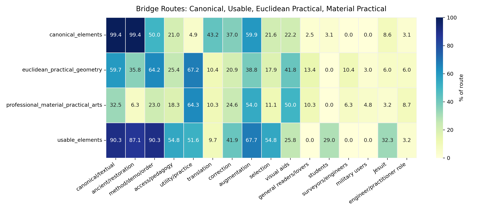

Two cases show the gradient clearly. `Paris_1622` presents the fifteen geometrical books of Euclid as translated from Greek into French, augmented with figures and demonstrations, and corrected against errors in other translations. It is not merely "vernacular" and not merely "learned"; it combines translation, correction, demonstration, visual furnishing, and ancient authority. `bib-9`, a 1544 Strasbourg practical geometry, is not a metadata Elements edition, but presents practical measurements of lines, surfaces, and bodies as derived from demonstrated Euclidean Elements. These two cases show the two directions of movement: Elements editions can become usable and vernacular, while non-Elements practical geometry can remain explicitly Euclidean.

This is the first major answer to the leading question. The place of the Elements in early modern mathematical print was not fixed at one point on a pure/applied spectrum. It was a canonical proof-corpus whose authority made it available for many acts of mediation, and whose methods could also authorize books outside the Elements corpus.

## 4. The Internal Ecology Of The Elements Corpus

The metadata-defined Elements corpus is not internally uniform. It has several recurring title-page postures. These are not hard subcorpora or mutually exclusive species. They are patterns in how title pages make Euclid public.

| Human-facing mode | Operational definition | Main historical function |
|---|---|---|
| Apparatus-rich learned Euclid | Editions advertised through additions, scholia, demonstrations, commentary, figures, correction, related texts, or institutional furnishing. | Euclid as a learned corpus requiring equipment. |
| Pedagogical or methodized Euclid | Editions advertised through method, order, easy demonstrations, explanation, propositions, or teaching value. | Euclid as a teachable sequence of mathematical reasoning. |
| Practical-pedagogical Euclid | Editions joining method or explanation to utility, selection, proposition-use, practical readers, or mathematical application. | Euclid made usable without ceasing to be Euclid. |
| Humanist or vernacular transfer | Editions emphasizing translation, ancient authority, Greek/Latin mediation, or movement into a vernacular language. | Euclid as cultural and textual transfer. |
| Sparse authoritative Euclid | Editions relying mainly on Euclid/*Elements* identity with few explicit social or intellectual claims. | Euclid as a name strong enough to do title-page work, but this must be controlled for format/place/title fashion. |

The strongest data result is that the center of the Elements corpus is not sparse. It is dense. Many title pages combine ancient authority, explicit Euclid/book identity, method, apparatus, correction, translation, and named mathematical parts.

**Selected rates by Elements posture:**

| Elements posture | Explicit Euclid/book identity | Ancient authority | Method/order | Any named part | Augmentation | Utility/practice | Translation |
|---|---:|---:|---:|---:|---:|---:|---:|
| Practical-pedagogical | 100.0% | 95.8% | 56.9% | 79.2% | 61.1% | 30.6% | 22.2% |
| Pedagogical/method | 93.1% | 79.3% | 79.3% | 79.3% | 17.2% | 0.0% | 3.4% |
| Institutional-composite | 88.5% | 88.5% | 45.1% | 66.4% | 56.6% | 0.0% | 32.7% |
| Humanist/vernacular transfer | 100.0% | 100.0% | 21.7% | 21.7% | 8.7% | 0.0% | 78.3% |
| Sparse authoritative | 100.0% | 85.7% | 0.0% | 4.8% | 0.0% | 0.0% | 4.8% |

Historical payoff: practical or pedagogical Euclid is not a break from canonical Euclid. The practical-pedagogical route is also 100.0% explicit Euclid/book identity and 95.8% ancient authority. Use and pedagogy are added onto authority rather than replacing it.

Figure:

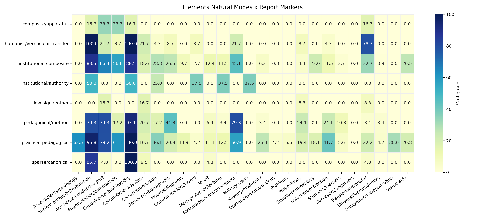

The sparse authoritative route is the cautionary opposite. It shows that some Elements title pages rely heavily on Euclid's name or book identity and say little else. But because sparse presentation correlates with title-page fashion, city, language, format, and book coverage, it should not be turned into a major claim about intellectual silence. It is a controlled contrast, not the center of the argument.

## 5. Book Coverage As Historical Repackaging

The number of books of the *Elements* included is not merely bibliographic extent. It often corresponds to a different public version of Euclid.

| Book group | Operational definition | Main title-page tendency |
|---|---|---|
| First six books | Editions centered on books 1-6, usually plane geometry and foundations. | Elementary, foundational, often portable; sometimes vernacular and practical. |
| First six plus solid geometry | Editions combining books 1-6 with books 11-12 or equivalent solid geometry. | A more usable package: plane foundations plus enough solid geometry for practical or institutional mathematics. |
| Near-complete or expanded | Editions presenting most or all of the *Elements*, often with other Euclidean or mathematical material. | Learned, apparatus-rich, translated, corrected, demonstrated Euclid. |
| Selected later books | Editions extracting later/difficult books or parts. | Selection as learned handling or reform, not necessarily simplification. |

**Book coverage and advertised work:**

| Book group | Method/order | Any named part | Propositions | Demonstrations | Commentary/scholia | Utility/practice | Translation | Augmentation |
|---|---:|---:|---:|---:|---:|---:|---:|---:|
| First six books | 48.1% | 63.0% | 1.2% | 24.7% | 9.9% | 6.2% | 21.0% | 42.0% |
| First six plus solid geometry | 64.1% | 61.5% | 35.9% | 12.8% | 0.0% | 28.2% | 2.6% | 25.6% |
| Near-complete/expanded | 49.3% | 61.2% | 9.0% | 34.3% | 23.9% | 1.5% | 41.8% | 55.2% |
| Selected later books | 38.1% | 42.9% | 4.8% | 19.0% | 14.3% | 4.8% | 23.8% | 23.8% |

Historical payoff: first-six-books Euclid and first-six-plus-solid-geometry Euclid are not just shorter and longer versions of the same thing. They advertise different uses. First-six-books editions emphasize foundations, selection, translation, demonstrations, and sometimes practical vernacular operation. First-six-plus-solid-geometry editions are much more likely to advertise propositions and utility. Near-complete editions are more likely to be translated, augmented, corrected, demonstrated, and furnished with commentary.

Figure:

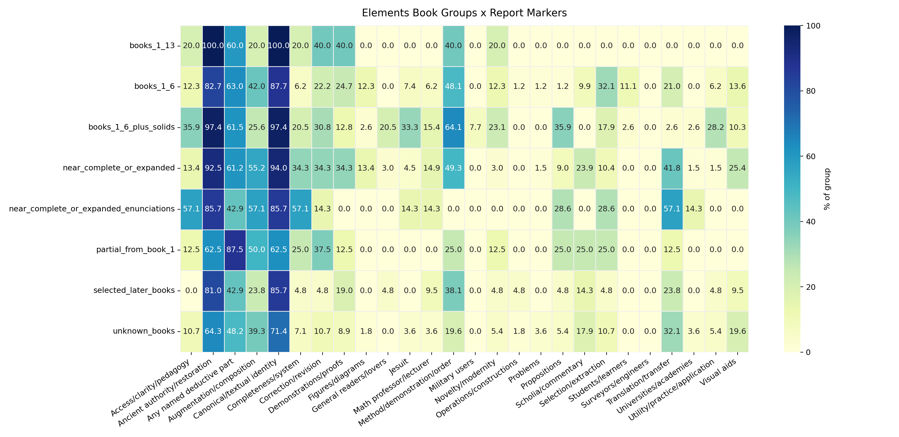

The proposition-use result makes this sharper:

| Book group | Any proposition motif | Use/application of propositions | Demonstration motif | Easy/clear demonstrations |
|---|---:|---:|---:|---:|
| First six books | 1.2% | 1.2% | 23.5% | 2.5% |
| First six plus solid geometry | 35.9% | 20.5% | 12.8% | 10.3% |
| Near-complete/expanded | 9.0% | 0.0% | 32.8% | 9.0% |
| Selected later books | 4.8% | 0.0% | 19.0% | 4.8% |

Historical payoff: "use of propositions" is not a general Elements trait. It is concentrated in the first-six-plus-solid-geometry route, especially the Dechales/Reeve/Williams style of practical-pedagogical Euclid. Near-complete editions are more demonstration-heavy than proposition-use heavy. Plain first-six-books editions are often foundational and pedagogical, but not usually through explicit "use of every proposition" rhetoric.

Two cases anchor this contrast. `Rotterdam_1647` presents the first six books through foundations of geometry, Dutch translation, explanation, correction, utilities drawn from Euclid, geometrical operations, public lovers of mathematics, and surveyor authority. It is practical without books 11-12. `London_1685a`, by contrast, presents the first six books plus solid geometry through explanation, demonstration, easy method, uses of each proposition, copper plates, translation, correction, and augmentation. It is practical-pedagogical through proposition-use and method.

## 6. Format, Size, And Material Presentation

Format is not a direct audience label. A folio is not automatically institutional, an octavo is not automatically a student book, and a duodecimo is not automatically popular. But format is material evidence: it changes price, portability, space for apparatus, likely reading setting, and local title-page convention. In this report, format is therefore used in two ways: as a historical clue about how an edition was packaged, and as a control against over-reading silence or density.

Format codes follow the metadata: `2` = folio, `4` = quarto, `8` = octavo, `12` = duodecimo. The strongest evidence below is internal to the metadata-defined Elements corpus, where format is available for most representatives. Corpus-wide format comparison is weaker because many non-Elements rows have missing format metadata.

**Elements format profile:**

| Format | Elements reps. | Share | Sparse authoritative | Avg. rich claims | Avg. social arenas |
|---|---:|---:|---:|---:|---:|
| Folio | 54 | 18.9% | 9.3% | 3.67 | 1.04 |
| Quarto | 67 | 23.4% | 11.9% | 3.37 | 1.27 |
| Octavo | 111 | 38.8% | 15.3% | 4.30 | 1.19 |
| Duodecimo | 30 | 10.5% | 16.7% | 4.40 | 0.93 |
| Other small formats | 6 | 2.1% | 50.0% | 2.67 | 0.17 |
| Missing/unknown | 18 | 6.3% | 33.3% | 2.94 | 0.78 |

The first result is negative but important: smaller format does not mean thinner title-page rhetoric. Octavos and duodecimos have the highest average rich-claim counts in the Elements corpus. Their sparse-authoritative rates are higher than folios and quartos, but only modestly so for the main formats: 15.3% in octavos and 16.7% in duodecimos, compared with 9.3% in folios and 11.9% in quartos. This means format can help explain some silence, but it cannot explain away the dense pedagogical and methodological rhetoric of many small-format Elements editions.

The second result is that each format packages Euclid differently.

| Format | Strongest mode signals | Main historical reading |
|---|---|---|
| Folio | composite apparatus 85.2%; humanist/ancient 81.5%; institutional authority 75.9%; augmentation 57.4% | Folio Euclid most often appears as furnished learned apparatus: ancient authority, additions, commentary, and institutional weight. |
| Quarto | institutional authority 74.6%; humanist/ancient 77.6%; vernacular transfer 53.7%; composite apparatus 65.7% | Quarto Euclid is the most mixed large-middle format: learned/institutional, but also strongly associated with translation and transfer. |
| Octavo | humanist/ancient 91.0%; pedagogical/method 79.3%; institutional authority 78.4%; correction 33.3% | Octavo Euclid is not merely a cheap or stripped school object. It often combines portability with explicit authority, method, and correction. |
| Duodecimo | institutional authority 90.0%; humanist/ancient 90.0%; pedagogical/method 76.7%; practical/public 40.0%; access/clarity 40.0%; Jesuit 26.7% | Duodecimo Euclid is the clearest case where small format looks pedagogical-institutional rather than simply popular. |

This matters for the report's social-intellectual argument. The small-format Elements editions do not simply move Euclid from learned culture into a public marketplace. They often make Euclid portable while keeping him tied to ancient authority, method, institutional legitimacy, and correction. The social signal is sometimes not a named reader but a teaching regime: Jesuit identity, university/academy markers, professorial roles, method, correction, and clarity.

Book coverage sharpens this. Folios have the highest near-complete/expanded share among known formats: 38.9%, with a large unknown-book group as well. Duodecimos cluster around first-six-books and first-six-plus-solid-geometry packages: 33.3% each. Quartos and octavos are more mixed. This suggests that material packaging and textual packaging moved together: large formats more often support expanded or apparatus-heavy Euclid, while smaller formats often support foundational, teachable, or selectively useful Euclid. But the boundary is flexible, not absolute; octavos also include near-complete/expanded editions at 29.7%.

**Book coverage by Elements format:**

| Format | First six | First six + solids | Near-complete/expanded | Selected later books | Unknown books |
|---|---:|---:|---:|---:|---:|
| Folio | 18.5% | 0.0% | 38.9% | 3.7% | 35.2% |
| Quarto | 29.9% | 10.4% | 11.9% | 13.4% | 25.4% |
| Octavo | 27.9% | 15.3% | 29.7% | 8.1% | 9.9% |
| Duodecimo | 33.3% | 33.3% | 10.0% | 0.0% | 13.3% |

The figure/diagram evidence adds a final warning. Across known-format rows in the broader corpus, folios and quartos have much higher metadata diagram rates than octavos and duodecimos, but octavos still have frequent visual title-page claims. In other words, visuality is not only a matter of physical diagram abundance. A title page may advertise figures, demonstrations, or visual method even when the metadata does not mark the book as diagram-rich.

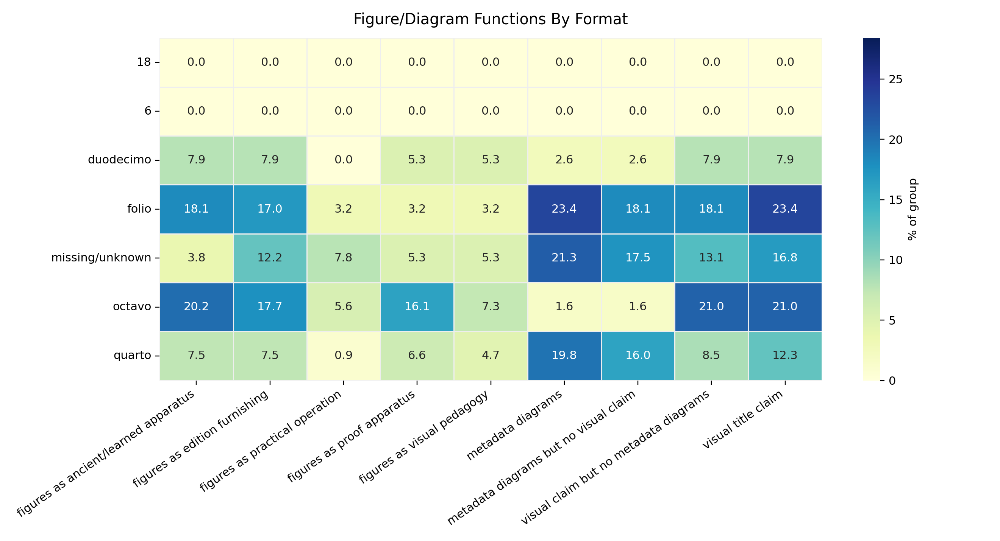

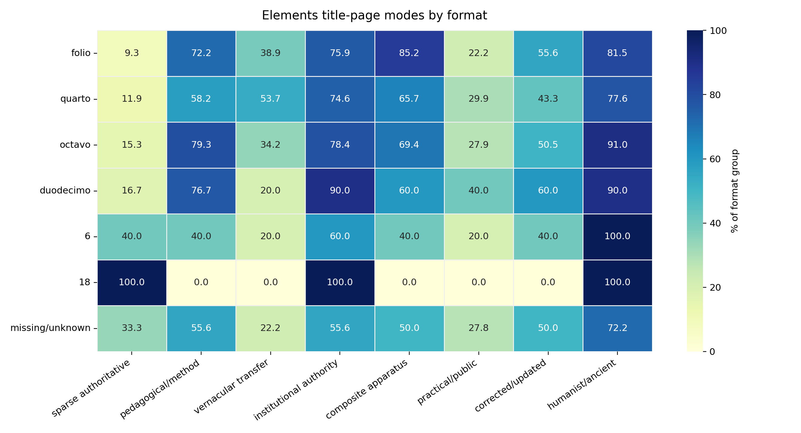

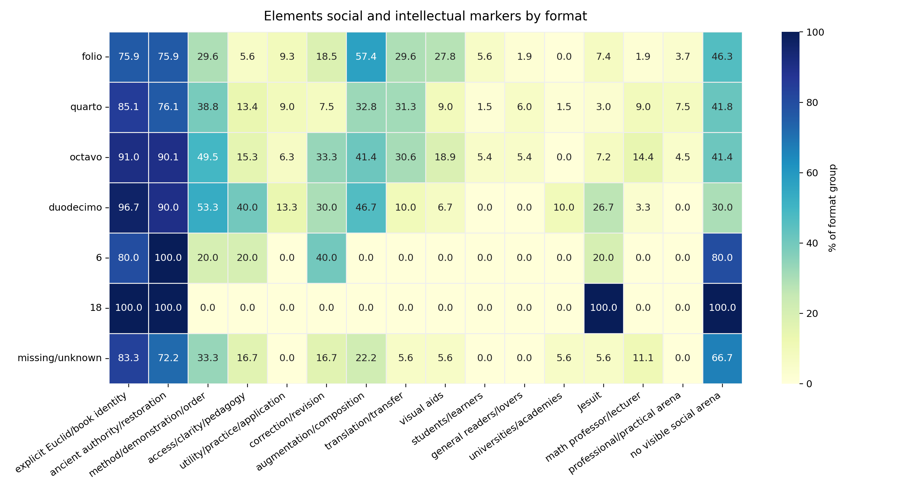

Historical payoff: format should change how we interpret both audience and intellectual values. A sparse folio and a sparse octavo are not the same kind of silence. A duodecimo with Jesuit, method, correction, and ancient-authority language is not simply a small popular Euclid; it is a compact institutional-pedagogical Euclid. Conversely, a folio with augmentation and ancient apparatus is not just a larger container; it presents Euclid as a learned textual object capable of bearing correction, commentary, enrichment, and visual furnishing.

## 7. Social Worlds Of The Elements

The title pages do not define the social place of the Elements only by naming readers. They also construct social authority through editors, translators, professors, Jesuits, city officers, patrons, and institutions. The key question is therefore not simply "who was Euclid for?" but "what social authority made this Euclid credible, teachable, or useful?"

The Elements corpus has relatively low explicit occupational audience rates. For example, in the overall Elements/non-Elements contrast, surveyors/engineers appear in 0.0% of Elements representatives and 1.4% of non-Elements representatives; military users appear in about 1.0% of Elements and 1.1% of non-Elements. This does not mean the Elements has no social life. It means its social life is often mediated indirectly: through institutions, editors, translators, professors, religious orders, or public language rather than direct profession labels.

**Social signals in major Elements book groups:**

| Book group | Jesuit | Math professor/lecturer | General readers/lovers | Students/learners | Universities/academies | Utility/practice |
|---|---:|---:|---:|---:|---:|---:|
| First six books | 7.4% | 6.2% | 0.0% | 11.1% | 0.0% | 6.2% |
| First six plus solid geometry | 33.3% | 15.4% | 20.5% | 2.6% | 2.6% | 28.2% |
| Near-complete/expanded | 4.5% | 14.9% | 3.0% | 0.0% | 1.5% | 1.5% |

Historical payoff: the social difference between book groups is real. First-six-plus-solid-geometry editions are much more socially explicit: high Jesuit signal, more professor/lecturer signal, more general readers/lovers, and much more utility. Near-complete editions are more learned and professorial but far less directly useful. First-six-books editions are relatively quiet socially but can still become practical through local cases such as the Dutch/Dou tradition.

Cases show why percentages alone are not enough. `Rotterdam_1647` names public lovers of the liberal art and carries the authority of a city surveyor and wine-gauger. That is not a generic schoolbook social world; it is civic, vernacular, and practical. `Cologne_1591` and `Frankfurt_1607` point toward a different social world: Jesuit and Clavius-style institutional authority, where Euclid is furnished through demonstrations, scholia, correction, and learned apparatus. `London_1685a` then combines a Jesuit authorial source with English translation and practical-pedagogical proposition-use.

This is the social-intellectual hinge of the report. Social address does not merely tell us who might read the book. It changes what counts as valuable Euclid: ancient restoration in a humanist setting, institutional apparatus in a Jesuit setting, public explanation in a vernacular setting, proposition-use in a practical-pedagogical setting, or civic operation in a surveyor's setting.

## 8. Intellectual Values Of The Elements

The intellectual values of the Elements are best understood as advertised acts of mediation. A title page can make Euclid valuable by saying he has been restored, translated, corrected, explained, demonstrated, selected, augmented, illustrated, or reorganized.

Commentary is the clearest example of why the report must split broad labels into historical functions. "Commentary" does not always mean the same thing.

**Commentary/explanation by corpus:**

| Commentary function | Elements | Non-Elements | Historical reading |
|---|---:|---:|---|
| Any commentary/explanation | 32.2% | 13.8% | Commentary is much more central to the Elements. |
| Ancient/humanist scholia | 12.6% | 1.4% | The Elements often carries learned ancient apparatus. |
| Pedagogical explanation | 12.9% | 5.6% | Explanation is a major route for making Euclid teachable. |
| Clavius/Jesuit commentary | 3.5% | 1.1% | Institutional commentary is a smaller but important route. |
| Notes/annotations/observations | 5.6% | 6.6% | Notes are broad mathematical apparatus, not Elements-specific. |

Historical payoff: the Elements is not merely "commented." Commentary can perform at least three different jobs: restore ancient authority, furnish an institutional corpus, or explain Euclid to learners and vernacular readers.

The split by Elements posture makes this clearer:

| Elements posture | Any commentary | Ancient/humanist scholia | Pedagogical explanation | Clavius/Jesuit commentary |
|---|---:|---:|---:|---:|
| Practical-pedagogical | 41.7% | 6.9% | 29.2% | 2.8% |
| Institutional-composite | 39.8% | 17.7% | 9.7% | 7.1% |
| Humanist/vernacular transfer | 30.4% | 30.4% | 4.3% | 0.0% |
| Pedagogical/method | 27.6% | 10.3% | 10.3% | 0.0% |

Historical payoff: vernacular transfer is not automatically popular simplification. In the humanist/vernacular-transfer route, commentary is overwhelmingly ancient/humanist scholia. By contrast, in the practical-pedagogical route, commentary becomes explanation. The same act, adding commentary, changes meaning depending on the social and intellectual setting.

`Urbino_1575` is useful here because it is vernacular but still learned: Italian Euclid with ancient scholia and humanist apparatus. `Rome_1591` and `Rome_1609` show commentary as recovery and learned furnishing: ancient scholia, figures, Greek-to-Latin transfer, and Maurolico annotations. `London_1570` shows another route: English Euclid with scholies, annotations, inventions, and Dee's preface, where vernacular access, commentary, and public mathematical ambition meet.

The intellectual values suppressed or rarely advertised are also important. Axioms/common notions appear in only 0.3% of Elements representatives; definitions in 1.4%; postulates are not a major title-page selling point. Title pages do not usually sell the Elements by naming the axiomatic base. They sell it through demonstrations, propositions, scholia, principles, translation, correction, and apparatus. This matters because the title-page Euclid is less "axiomatic foundations" than "mediated demonstrative corpus."

## 9. Mathematical Parts Of Euclid On Title Pages

Title pages sometimes describe mathematics by naming its parts: demonstrations, propositions, scholia, figures, corollaries, principles, problems, operations, examples, and so on. These named parts show what the title page thinks mathematical knowledge is made of.

The Elements is much more likely than the surrounding ecology to name at least one such part: 57.7% of Elements representatives, compared with 34.8% of non-Elements representatives. But the important point is the kind of part named.

**Named mathematical parts, interpreted:**

| Part | Elements | Non-Elements | Main interpretation |
|---|---:|---:|---|
| Demonstrations/proofs | 21.0% | 7.5% | Euclid as proof-corpus. |
| Scholia/commentary | 13.6% | 6.5% | Euclid as commented corpus. |
| Propositions | 10.1% | 4.5% | Euclid as sequence of units that can be taught, selected, or used. |
| Principles | 9.4% | 3.1% | Euclid as foundation. |
| Theorems | 5.9% | 3.8% | Euclid as theorem-bearing demonstrative text. |
| Figures/diagrams | 7.3% | 7.7% | Shared visual technology, not a distinctive Elements signal. |
| Operations/constructions | 1.0% | 4.1% | More characteristic of practical/procedural books. |
| Problems | 1.4% | 3.8% | More characteristic of problem-solving mathematical print. |
| Examples | 1.0% | 2.2% | More characteristic of procedural pedagogy outside Elements. |

Historical payoff: the Elements is advertised less as geometry in general than as a corpus of demonstrative and commentarial parts. Non-Elements mathematics more often appears as operation, construction, problem, example, or direct use.

Propositions deserve special attention because they can do different kinds of work. In some title pages a proposition is a proof unit; in others it becomes a teaching unit, a selected extract, a reduced sequence, or a usable/application unit.

`London_1685a` and `London_1703` advertise the uses of each proposition in all parts of mathematics. That is a very specific kind of practical Euclid: not merely "Euclid is useful," but "each proposition can be attached to mathematical uses." `Paris_1640` is different: it reduces Euclid's tenth book to 62 propositions with easier and shorter demonstrations. Here propositions are not primarily application units; they are units to be reorganized for intelligibility and method. `Cologne_1556` is different again: selected propositions are ordered so that they can be demonstrated according to geometrical method.

Figures and diagrams require the same caution. Visual title-page claims appear at almost the same rate in Elements and non-Elements, 17.8% versus 16.7%. Metadata diagram tags are actually higher in non-Elements, 24.8% versus 3.1%, which probably reflects the diagrammatic character of instruments, perspective, architecture, surveying, and other visual/material mathematical arts, as well as uneven metadata capture.

**Figure/diagram functions:**

| Visual function | Elements | Non-Elements | Historical reading |
|---|---:|---:|---|
| Visual title claim | 17.8% | 16.7% | Visuality is shared across mathematical print. |
| Figures as proof apparatus | 9.8% | 5.2% | In Elements, figures more often support demonstration. |
| Figures as ancient/learned apparatus | 17.5% | 3.8% | Elements figures often belong to restored/commented Euclid. |
| Figures as practical operation | 3.1% | 7.0% | Non-Elements figures more often support operation or use. |
| Figures as edition furnishing | 14.7% | 11.7% | Both corpora advertise visual furnishing. |

Historical payoff: figures are not an Elements marker by themselves. They become meaningful when attached to a function. In `Paris_1622`, figures join translation, correction, and demonstrations. In the Dutch/Dou route, figures join foundations, utility, and geometrical operations. In non-Elements practical geometry, figures more often belong to instruments, surveying, perspective, construction, or measurement.

Figures:

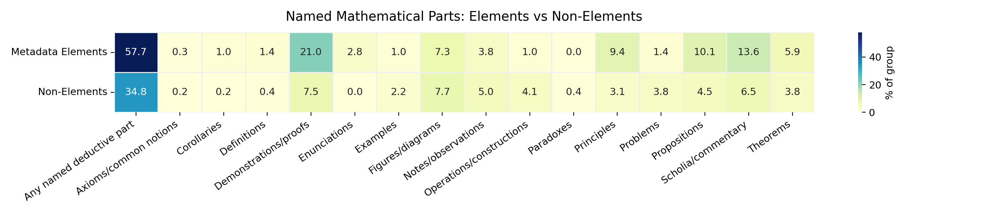

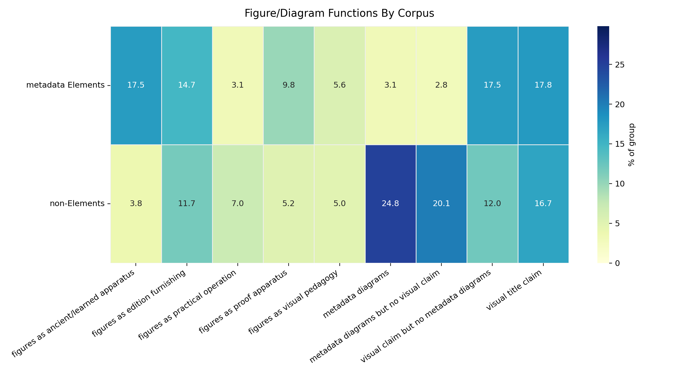

The section's main conclusion is therefore precise: the title-page Elements is not merely a book of geometry. It is a manipulable proof-corpus whose parts can be advertised, selected, explained, used, reordered, illustrated, and socially redirected.

## 10. Restoration, Reconstruction, And Competing Euclids

Some title pages do more than transmit, translate, or correct Euclid. They claim to reorder, reform, reduce, newly demonstrate, or otherwise reconstruct the Elements. This is not simply an opposition between fidelity to the ancients and modern freedom. The better question is: **what did a title page claim had to be restored in Euclid for the Elements to work?**

| Restoration ideal | What is restored | Typical title-page actions | Main historical meaning |
|---|---|---|---|
| Ancient-text restoration | The authentic ancient text, transmission, or commentary tradition | correct, emend, restore, purge errors, return to Greek/ancient scholia | Fidelity to Euclid as inherited textual authority. |
| Corrective-pedagogical mediation | The canonical text as teachable and usable | correct, translate, augment, explain, illustrate, demonstrate | Euclid remains authoritative but is made pedagogically functional. |
| Logical/demonstrative restoration | Euclid's order, proof, clarity, and rational force | new order, new demonstrations, reduced propositions, easier proofs | Fidelity to Euclidean reason rather than inherited arrangement. |
| Symbolic/analytic retooling | The portability or generality of proof | algebraic signs, analytic notation, symbolic demonstration | Euclid is modernized as a formal proof system. |
| Practical/technical refunctionalization | Euclid's usefulness for mathematical work | use of propositions, easy method, technical audiences, plane/solid geometry | Euclid becomes operational for practical users. |
| Selection/contraction | A manageable, teachable Euclid | select, contract, abridge, extract, make succinct | Euclid is scaled to curriculum, convenience, or portability. |

The strict "new Elements" pole is small. A broad search for new, reordered, reduced, contracted, symbolically retooled, or newly demonstrated Elements found 80 candidates, but only a few are strong cases of full reconstructive ambition.

**Reconstructive rhetoric by type:**

| Reconstructive type | Cases | Novelty claim | Method/order | Ancient restoration | Reading |
|---|---:|---:|---:|---:|---|
| Strong new Elements | 2 | 100.0% | 100.0% | 50.0% | Rare, explicit remaking. |
| New order and demonstration | 3 | 100.0% | 100.0% | 100.0% | New method can still coexist with restoration. |
| Reordered or new demonstrations | 18 | 33.3% | 77.8% | 83.3% | Most cases remain hybrid. |
| Selected/reduced/contracted | 28 | 10.7% | 71.4% | 96.4% | Reshaping often preserves Euclidean authority. |
| Method/ease/retooling | 29 | 3.4% | 65.5% | 93.1% | Pedagogical modernization usually remains canonical. |

Historical payoff: reconstruction is usually not anti-Euclidean. Most title pages that reshape Euclid still preserve ancient authority or Euclidean identity. The exception is not "modernity versus tradition," but a set of competing restoration ideals.

`Paris_1667`, Arnauld's *Nouveaux Elemens de Geometrie*, is the cleanest case of strict reconstruction. Its title page advertises a new order, new demonstrations of common propositions, new ways to show incommensurable lines, new measures of angles, and new ways to find and demonstrate line proportions. Its authority is not primarily fidelity to ancient wording. It claims that geometry works better when its order and demonstrations are remade.

`Livorno_1709`, *Euclides Reformatus*, keeps Euclid's name but makes reform the central act. It advertises plane and solid geometry through a new method and clearer, easier, firmer, more evident exposition and demonstration. This is not a rejection of Euclid. It is a claim that Euclid can be more truly Euclidean if his method and demonstration are reformed.

Earlier and narrower cases show that reconstruction had roots before the strongest late examples. `Cologne_1556` selects propositions from later books and orders them so they can be demonstrated according to geometrical method. `Paris_1640` reduces Euclid's tenth book to 62 propositions and supplies easier, shorter demonstrations, alongside a discourse on explaining the sciences in French. These cases show reconstruction as selection, reduction, and pedagogical reordering rather than wholesale replacement.

The report should therefore avoid saying that reconstructive Euclid is the opposite of philological Euclid. It is better to say that early modern title pages imagine several Euclids worth restoring: Euclid the ancient text, Euclid the corrected tradition, Euclid the demonstrative order, Euclid the teachable method, Euclid the usable proposition-sequence, and Euclid the portable proof system.

## 11. Boundaries And Gradients

The metadata-defined Elements corpus has a clear boundary for this report, but the title-page ecology around it does not. Euclid can appear as text, method, foundation, authority, school object, practical extract, or style of mathematical organization.

The bridge-case table in Section 3 already showed the main gradient:

1. Euclid as restored or authoritative text.
2. Euclid made usable.
3. Euclidean practical geometry outside the metadata Elements corpus.
4. Professional and material mathematical arts.

The important point is overlap. Usability often overlaps with canonical authority: 17 of 31 "Euclid made usable" cases also belong to the restored/authoritative route. Practical mathematics also overlaps with Euclidean authority: 43 of 67 Euclidean practical-geometry cases also belong to professional/material practical arts.

This gives the report a more precise boundary claim. The Elements is not dissolved into the broader ecology; the metadata-defined corpus remains distinctive in ancient authority, explicit book identity, demonstration, commentary, translation, and named mathematical parts. But the functions of the Elements travel. Outside the corpus, Euclid can authorize practical geometry. Inside the corpus, Euclid can be made useful, vernacular, pedagogical, institutional, or practical.

`Paris_1622` and `bib-9` are the best paired examples. `Paris_1622` is firmly within the Elements corpus but makes Euclid vernacular, corrected, demonstrated, and visually furnished. `bib-9` is outside the Elements corpus but grounds practical geometry in demonstrated Euclidean Elements. The pair shows that corpus boundary and intellectual function do not always align.

`Cambridge_1703` adds a further complication. It advertises elements of plane and solid geometry with selected Archimedean theorems, corollaries, applications, corrections, diagrams, and Lucasian professorial authority, without depending on explicit Euclid as the main identity. It is not simply an Elements edition, but it occupies an Elements-like space: ordered geometry, proof apparatus, applications, and institutional authority.

Historical payoff: the place of the Elements in early modern print is best described as a **central canonical corpus with mobile functions**. Its authority can be internalized in editions of Euclid, exported to practical geometry, imitated in Elements-like geometries, or transformed into pedagogical and technical packages.

## 12. Silence, Density, And Title-Page Fashion

Some Elements title pages say very little beyond Euclid, the *Elements*, or the books included. It is tempting to interpret this as authority-sufficient presentation: Euclid's name was strong enough that nothing more needed to be advertised. That may sometimes be true, but it cannot be assumed.

The analysis tested sparse authoritative presentation against controls such as city, language, format, period, book coverage, and institutional visibility. The result is methodological caution.

| Control or condition | Association with sparse/silent presentation | Reading |
|---|---:|---|
| City and sparse authoritative mode | Cramer's V = 0.487 | Local title-page fashion is a strong factor. |
| Language and sparse authoritative mode | Cramer's V = 0.306 | Language communities differ in title-page density. |
| Format and sparse authoritative mode | Cramer's V = 0.179 | Format matters, but less than city/language. |
| Period and sparse authoritative mode | Cramer's V = 0.165 | Chronology matters, but is not the strongest driver. |
| Any school/institution marker absent | 23.5% sparse authoritative | Lack of institutional markers increases apparent sparseness. |
| Any school/institution marker present | 3.4% sparse authoritative | Explicit institutions make title pages socially denser. |

Historical payoff: sparse presentation is real, but it is not a pure intellectual signal. Some sparse title pages may rely on Euclid's authority. Others may reflect local printing style, language convention, format, schoolbook convention, or incomplete/quiet title-page rhetoric.

The high-risk zones confirm the caution. Bologna, Leipzig, Italian-language cases, pre-1550 Latin octavos, and some first-six-books formats show elevated sparse behavior. This means that a short Italian octavo Elements title page, for example, should not immediately be interpreted as a philosophical statement about Euclid's self-sufficient authority.

The safest claim is therefore:

Sparse authoritative presentation is a contrast mode inside the Elements corpus, not a main thesis. It can help identify cases where Euclid's name and book identity do much of the work, but only after controlling for title-page fashion.

This control also protects the broader argument. The report is not claiming that dense title pages are intellectually serious and sparse title pages are not. Both can be meaningful. The point is that density and silence are themselves historically conditioned forms of title-page rhetoric.

## 13. Final Synthesis

The leading question asked what place the metadata-defined Elements corpus occupied in the broader ecology of early modern mathematical print, and how title pages constructed that place through social address, intellectual values, and acts of textual or mathematical mediation.

The answer is not that the Elements was simply stable, theoretical, or separate from practical mathematics. The stronger answer is:

**The Elements functioned as a canonical proof-corpus whose authority made it unusually available for mediation.**

Title pages repeatedly make Euclid valuable by showing what has been done to him:

- restored as an ancient text;
- corrected against errors;
- translated across languages;
- explained for readers;
- demonstrated in new or easier ways;
- selected, contracted, or reduced;
- augmented with scholia, figures, corollaries, related texts, or applications;
- reorganized for method, pedagogy, or use;
- attached to institutions, professors, Jesuits, surveyors, translators, patrons, and publics.

This is why the Elements is distinctive in the data. Compared with the surrounding corpus, Elements title pages far more often advertise ancient authority, explicit Euclid/book identity, method and demonstration, named mathematical parts, translation, commentary, and apparatus. Surrounding mathematical books more often advertise direct practical use, operations, instruments, examples, problems, visual/material work, and professional application.

But the distinction is not a wall. It is a structured gradient. Some Elements editions become practical, public, vernacular, or pedagogical. Some non-Elements practical geometries remain explicitly Euclidean. Some later geometries imitate Elements-like structure without centering Euclid as the named author. The Elements therefore lives in the broader ecology not only as a text, but as a repertoire of authority, method, sequence, proof, and mediation.

The social and intellectual halves of the argument are inseparable. Social setting changes what Euclid is for. Humanist and learned settings make commentary into ancient apparatus. Jesuit and institutional settings make Euclid into a furnished curriculum. Dutch civic-vernacular settings make the first six books into foundations, utilities, and geometrical operations. English practical-pedagogical settings turn propositions into usable units. Reconstructive settings ask whether Euclid is best restored as text, order, method, proof, or use.

The final claim is therefore not that early modern title pages preserve one Euclid. They preserve the possibility of many Euclids under the authority of one corpus. The *Elements* becomes a place where early modern mathematical print negotiates the relation between ancient authority and present use: not by abandoning the ancient text, but by repeatedly remaking what fidelity to it could mean.

## 14. Next Directions

These are not required for the current argument, but they would strengthen or refine it.

### Controlled Local Comparisons

The strongest next analysis would not rely primarily on same-author or same-editor comparison, because the corpus does not contain complete bibliographies for every named person. A stronger control would compare title pages within shared local and material conditions:

- same city or region;
- same language;
- same period or narrow date window;
- same format;
- same or similar subject zone;
- intersections of these controls, such as same city + same language + same format + within five or ten years.

This would test whether the Elements/non-Elements contrasts survive when title-page fashion, local printing habits, language, format, and chronology are held more constant. It would also help identify cases where an apparent Elements feature is really a local title-page convention.

Possible outputs:

- controlled contrast tables by city/language/format/period strata;
- local case clusters for Paris, Amsterdam/Rotterdam/Leiden, London/Oxford/Cambridge, Rome, Venice, Basel/Strasbourg, and German university or printing centers;
- paired close readings where Elements and non-Elements books share format, language, place, and date range.

### Format And Material Use

The format section above is now filled, but future work should refine it through controlled local comparisons rather than treating format as a standalone cause. Format may affect title-page density, audience, portability, institutional use, price, diagrammatic apparatus, and the degree to which a title page advertises practical or pedagogical functions. It should be treated as historical evidence and as a control variable.

### Case-Level Verification

Before final citation, major examples should be checked against full title-page transcriptions or images where possible. This is especially important for:

- sparse or silent title pages;
- cases used to define a route;
- translated or multilingual title pages;
- figure/diagram claims;
- reconstructive cases such as `Paris_1667`, `Livorno_1709`, `Paris_1640`, and `Cologne_1556`.

## Appendices

The appendices are drafted separately in `REPORT_APPENDICES.md`.

---

# Appendices

**The Place of Euclid's Elements in Early Modern Mathematical Print: A Title-Page Ecology**

These appendices document the data sources, operational definitions, generated tables, figures, case clusters, and caveats behind the report. They are meant as reading support, not as a second narrative argument.

## Appendix A: Corpus And Data Construction

The report counts representative title-page records. The main object is the metadata-defined Elements corpus: editions manually identified in `ocrflow/store/items_metadata` as primarily editions of Euclid's *Elements*. The comparison field is the remaining representative mathematical title-page corpus.

Important construction rules:

- representative-row logic;
- metadata-defined Elements corpus definition;
- non-Elements comparison corpus definition;
- reprints and representative keys;
- subject classification source;
- title-page feature extraction source;
- metadata source: `ocrflow/store/items_metadata`;
- known exclusions and old files not used.

Core count used in the report:

| Unit | Count |
|---|---:|
| Representative title-page rows | 843 |
| Metadata-defined Elements representatives | 286 |
| Non-Elements representatives | 557 |
| Rows with at least one named deductive/mathematical part | 359 |

Key files for checking the corpus:

- `tables/report_corpus_accounting.csv`
- `../derived_data/metadata_elements_corpus_ecology_matrix.csv`
- `../derived_data/title_page_analysis_matrix.csv`

## Appendix B: Terms And Feature Definitions

The report uses human-readable terms in the prose, but each term corresponds to one or more feature fields. The table below is the quick audit map.

| Report term | Data source / feature | Working definition |
|---|---|---|
| Metadata-defined Elements corpus | metadata fields from `ocrflow/store/items_metadata` | Editions manually identified in the metadata as primarily Euclid's *Elements*. |
| Explicit Euclid/book identity | `claim_canonical_textual_identity` | Title-page language presenting the work through Euclid, the *Elements*, numbered books, textual corpus identity, edition identity, or author/title authority. |
| Ancient authority/restoration | `claim_ancient_authority_restoration`; related value markers | Ancient, Greek/Latin, recovered, corrected tradition, humanist authority, restoration of an older text. |
| Mediation | multiple claim/action fields | Advertised acts performed on knowledge: translating, correcting, explaining, demonstrating, selecting, augmenting, furnishing, reforming, adapting. |
| Utility/practice/application | `claim_utility_practice_application` | Use, practice, application, professional operation, measurement, construction, or applied procedure. |
| Named mathematical/deductive part | `deductive_parts_cases.csv` | Propositions, demonstrations, scholia, figures, corollaries, problems, operations, examples, definitions, principles, etc. |
| Sparse authoritative presentation | sparse/canonical mode and related controls | Title pages relying heavily on Euclid/book identity with few explicit social/intellectual claims; use only with fashion controls. |

Full term source:

- `../orientation/ANALYSIS_TERMS.md`

## Appendix C: Core Tables

The report's main quantitative tables are generated as CSV files in `report/tables/`. The most important tables for rechecking the main claims are:

- `tables/report_elements_vs_non_elements_core_contrasts.csv`
- `tables/report_subject_intellectual_rates_matrix.csv`
- `tables/report_subject_social_rates_matrix.csv`
- `tables/report_elements_mode_marker_rates_matrix.csv`
- `tables/report_elements_bookgroup_marker_rates_matrix.csv`
- `tables/report_deductive_parts_by_corpus_matrix.csv`
- `tables/report_deductive_parts_by_bookgroup_matrix.csv`
- `tables/report_commentary_split_by_corpus_matrix.csv`
- `tables/report_commentary_split_by_elements_books_group_matrix.csv`
- `tables/report_prop_demo_motifs_by_elements_books_group_matrix.csv`
- `tables/report_figures_diagrams_by_corpus_matrix.csv`
- `tables/report_bridge_case_route_marker_rates_matrix.csv`
- `tables/report_bridge_case_route_overlap_matrix.csv`
- `tables/report_format_elements_marker_rates_matrix.csv`
- `tables/report_format_elements_mode_rates_matrix.csv`
- `tables/report_format_elements_bookgroup_distribution.csv`
- `tables/report_format_elements_density_summary.csv`
- `tables/report_format_full_corpus_subject_rates.csv`

## Appendix D: Figures And Visualizations

Figures are generated PNG files in `report/figures/`. The recommended main-report figures are:

| Figure | File | Best section |
|---|---|---|
| Top Elements vs non-Elements contrasts | `figures/bar_elements_vs_non_elements_top_contrasts.png` | Executive argument / Section 3 |
| Subject zones by intellectual values | `figures/heatmap_subject_intellectual_rates.png` | Section 2 |
| Subject zones by social markers | `figures/heatmap_subject_social_rates.png` | Section 2, with caution |
| Bridge routes | `figures/heatmap_bridge_route_marker_rates.png` | Section 3 / Section 11 |
| Elements postures/modes | `figures/heatmap_elements_mode_marker_rates.png` | Section 4 |
| Elements book groups | `figures/heatmap_elements_bookgroup_marker_rates.png` | Section 5 |
| Deductive parts by corpus | `figures/heatmap_deductive_parts_by_corpus.png` | Section 9 |
| Figure/diagram functions by corpus | `figures/heatmap_figures_diagrams_by_corpus.png` | Section 9 |
| Figure/diagram functions by format | `figures/heatmap_figures_diagrams_by_format.png` | Section 6 |
| Elements modes by format | `figures/heatmap_format_elements_modes.png` | Section 6 |
| Elements social/intellectual markers by format | `figures/heatmap_format_elements_markers.png` | Section 6 |
| Commentary by book group | `figures/heatmap_commentary_split_by_elements_books_group.png` | Section 8 |

Diagnostic figures to use with caution:

- `figures/pca_full_corpus_report_features.png`
- `figures/pca_elements_only_report_features.png`

The PCA plots are useful diagnostics for gradients, but they should not carry a proof claim by themselves because explained variance is modest.

## Appendix E: Casebook

The report uses cases to anchor quantitative claims. Each case should have one main argumentative job, so that examples do not become decorative.

Primary source:

- `supporting_notes/REPORT_CASEBOOK_SHORTLIST.md`

Case clusters:

| Cluster | Cases | Main job |
|---|---|---|
| Vernacular/practical first-six-books Euclid | `Rotterdam_1647`, `Amsterdam_1616`, `Amsterdam_1700b`, `Amsterdam_1701` | Dutch/Dou route: practical Euclid without books 11-12. |
| Proposition-use practical pedagogy | `London_1685a`, `London_1703`, `Oxford_London_1700` | Uses of propositions, easy method, translation, correction. |
| Humanist/learned apparatus | `Urbino_1575`, `Rome_1591`, `Rome_1609`, `Paris_1622` | Translation, ancient scholia, figures, correction, demonstrations. |
| Jesuit/institutional apparatus | `Cologne_1591`, `Frankfurt_1607`, `Rome_1603` | Euclid as furnished institutional curriculum. |
| Reconstruction/logical restoration | `Paris_1667`, `Livorno_1709`, `Paris_1640`, `Cologne_1556` | New order, reform, reduced propositions, easier demonstrations. |
| Euclidean practical geometry outside Elements | `bib-9`, `bib-135` | Euclid as foundation/method outside metadata Elements corpus. |

## Appendix F: Methodological Caveats

These caveats should travel with the report's claims:

- Title pages are evidence of public framing, not full book contents.
- Metadata Elements is the report's corpus definition; title-page mentions of Euclid/Elements are comparison evidence, not corpus definition.
- Subject classification and title-page feature tags must be read together.
- Rich tags are useful for navigation and aggregation but should be verified by close reading for major claims.
- Sparse or silent title pages cannot be interpreted without period/place/language/format controls.
- Format is historical evidence and a control variable.
- Patronage is not readership.
- Author/editor portfolio evidence is corpus-internal, not full bibliography.

## Appendix G: Next-Direction Analysis Plan

The strongest future analysis would refine the report through controlled local comparisons.

Controlled local comparisons by:

- city or region;
- language;
- format;
- period/date window;
- subject zone;
- intersections such as city + language + format + period.

This would test whether the Elements/non-Elements contrasts survive local title-page fashion and material book conventions better than same-author analysis alone.
